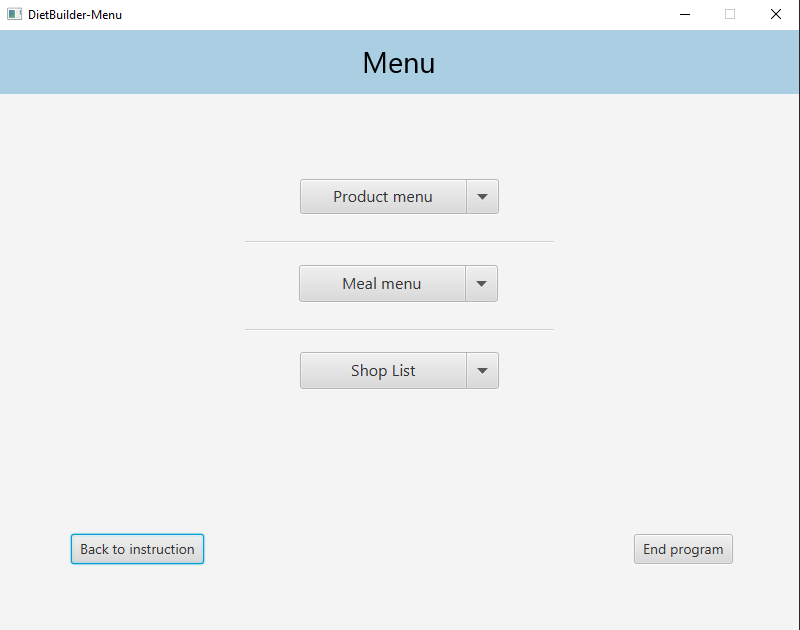
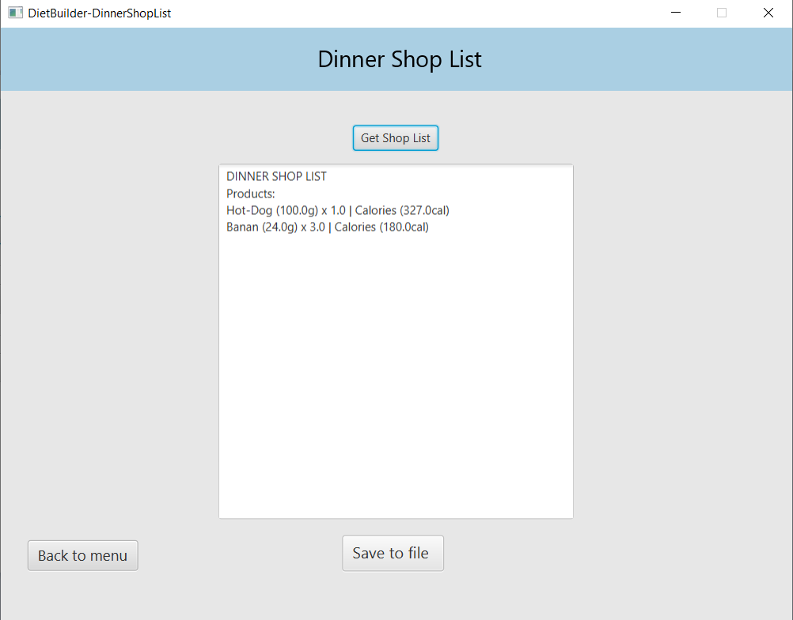

#  Diet Builder
This project is a laboratory assignment for the Programming Languages course at Wrocław University of Science and Technology. It represents an application with a graphical user interface (GUI) developed using JavaFX technology, which uses a MySQL database. The project also uses Maven for dependency management and application building.

## Table of Contents

 - [Project Overview](#project-overview)
 - [Functionality](#functionality)
 - [Database Management of Products and Meals](#database-management-of-products-and-meals)
 - [Installation and Running the Application](#installation-and-running-the-application)
 - [Application GUI](#application-gui)
 - [Contact](#contact)

## Project Overview
Diet Builder is a graphical user interface (GUI) application that allows users to create a personalized shopping list. The application automatically calculates the calorie content of each meal and individual products, making it easier to plan a diet and control calorie intake.

## Functionality
- users can add, edit, and delete individual products, defining their metadata, for example:.
```bash
Banana (100g):
- Carbohydrates (g): 23,
- Fats (g): 0,
- Protein (g): 1,
- Category: Fruits

```
- users can create, edit, and delete meals by grouping specific products into sections (e.g., breakfast, lunch, dinner), for example:
```bash
Name: Lunch
Products:
- Roll (100g) x 2
- Ham (slice) x 2
- Butter (5g) x 4

Name: Afternoon Snack v3
Products:
- Banana (100g) x 0.5

```
- Each meal displays the total amount of macronutrients and calculates the number of calories (dynamically based on macronutrients).

- Users have the ability to generate a shopping list for selected meals in PDF format. Products should be consolidated and grouped by category (e.g., if a banana appears in multiple meals, it should be listed only once under the Fruits category in the shopping list). 

## Database Management of Products and Meals


### Database Structure

The database contains the following tables:

#### Table `products`
This table stores information about food products.

- **`name`**: VARCHAR(60), Primary Key - product name.
- **`mass`**: DOUBLE, Not Null - product mass in grams.
- **`carbohydrates`**: DOUBLE, Not Null - carbohydrate content in grams.
- **`fats`**: DOUBLE, Not Null - fat content in grams.
- **`protein`**: DOUBLE, Not Null - protein content in grams.
- **`category`**: VARCHAR(100), Not Null - product category.

#### Table `breakfast`
This table stores information about products used to prepare breakfast.

- **`name`**: VARCHAR(60), Primary Key - product name.
- **`mass`**: DOUBLE, Not Null - product mass in grams.
- **`carbohydrates`**: DOUBLE, Not Null - carbohydrate content in grams.
- **`fats`**: DOUBLE, Not Null - fat content in grams.
- **`protein`**: DOUBLE, Not Null - protein content in grams.
- **`category`**: VARCHAR(100), Not Null - product category.
- **`amount`**: DOUBLE, Not Null - product amount in the meal.

#### Table `lunch`
This table stores information about products used to prepare lunch.

- **`name`**: VARCHAR(60), Primary Key - product name.
- **`mass`**: DOUBLE, Not Null - product mass in grams.
- **`carbohydrates`**: DOUBLE, Not Null - carbohydrate content in grams.
- **`fats`**: DOUBLE, Not Null - fat content in grams.
- **`protein`**: DOUBLE, Not Null - protein content in grams.
- **`category`**: VARCHAR(100), Not Null - product category.
- **`amount`**: DOUBLE, Not Null - product amount in the meal.

#### Table `dinner`
This table stores information about products used to prepare dinner.

- **`name`**: VARCHAR(60), Primary Key - product name.
- **`mass`**: DOUBLE, Not Null - product mass in grams.
- **`carbohydrates`**: DOUBLE, Not Null - carbohydrate content in grams.
- **`fats`**: DOUBLE, Not Null - fat content in grams.
- **`protein`**: DOUBLE, Not Null - protein content in grams.
- **`category`**: VARCHAR(100), Not Null - product category.
- **`amount`**: DOUBLE, Not Null - product amount in the meal.

## Installation and Running the Application

**Step 1: Clone the repository**
    
Start by cloning the Diet Builder repository to your local system. This will create a copy of the latest source code of the project on your machine. Open a command line interface (CLI) and run the following command:

```bash
  git clone https://github.com/makszdanowicz/Diet-Builder_lab4_jp.git
```

**Step 2: Proceed to  `Database Connection Setup`**

**Step 3: Navigate to the project directory**

After cloning the repository, navigate to the project directory:

```bash
   cd Diet-Builder
```
**Step 4: Run the application**

Run the application using the executable JAR file by typing in the console:
```bash
    java -jar "project_location\target\JAR_file_name.jar"
```

### Database Connection Setup

**Step 1: Create a database in MySQL and import the `diet_schema.sql` file from `/docs`**

**Step 2: In the `/src/main/resources/` directory, create a configuration file named `config_db.properties`**


**Step 3: Configure the `config_db.properties`file to set up database login credentials.**

```bash
db.url=jdbc:mysql://localhost:3306/database_name
db.username=your_database_username
db.password=your_database_password
```

Make sure to add this file to .gitignore to protect your login credentials.


## Application GUI
**Screenshot of the main menu::**


**Example of main menu functionality:**


**Example of shopping list generation:**



## Contact

If you have any questions, please contact me at:

- email: zdanowiczmm@gmail.com
- LinkedIn: http://www.linkedin.com/in/maksim-zdanovich
