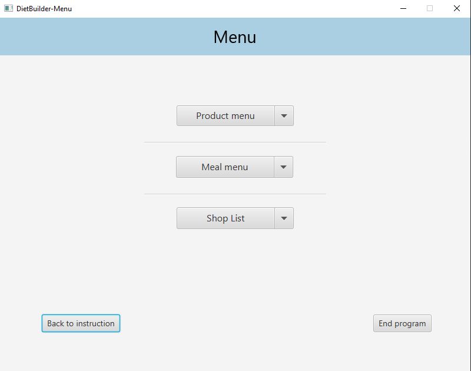
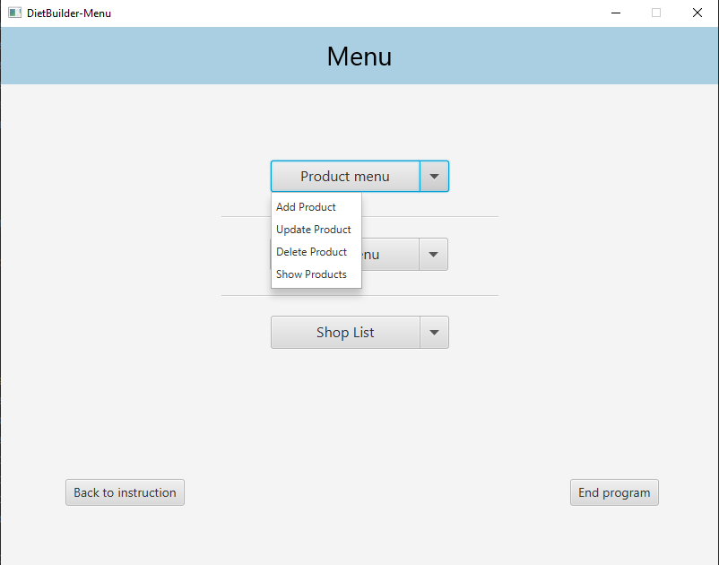
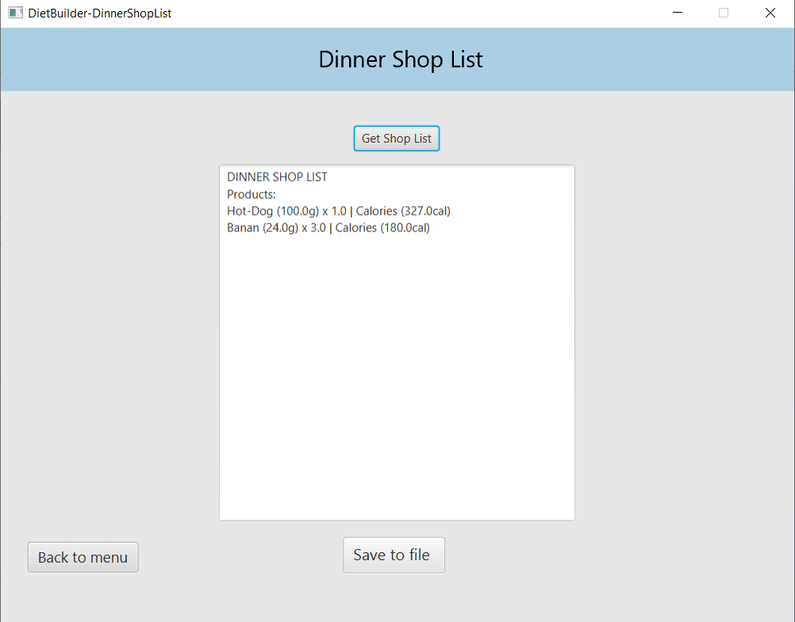

#  Diet Builder
Diet Builder to aplikacja z graficznym interfejsem użytkownika, która umożliwia tworzenie spersonalizowanej listy zakupów. Aplikacja automatycznie oblicza liczbę kalorii każdego posiłku oraz poszczególnych produktów, co ułatwia planowanie diety i kontrolowanie spożycia kalorii. 


## Spis treści

 - [Funkcjonalność](#funkcjonalość)
 - [Instalacja i uruchomenie aplikacji](#instalacja)
 - [Interface aplikacji](#interface)
 - [Kontakt](#kontakt)


## Funkcjonalność
- użytkownik może dodawać, edytować i usuwać pojedyncze produkty definiując ich metadane, np.
```bash
Banan (100g):
- Węglowodany (g): 23,
- Tłuszcze (g): 0,
- Białko (g): 1,
- Kategoria: Owoce

```
- użytkownik może tworzyć, edytować i usuwać posiłki grupując określone produkty w sekcje (np. śniadanie, obiad, kolacja), np.
```bash
Nazwa: Lunch
Produkty:
- Bułka (100g) x 2
- Szynka (plaster) x 2
- Masło (5g) x 4

Nazwa: Podwieczorek v3
Produkty:
- Banan (100g) x 0.5

```
- Każdy posiłek prezentuje sumaryczną ilość przyjętych makroskładników oraz oblicza ilość kalorii (dynamicznie na podstawie makroskładników).

- Użytkownik ma możliwość wygenerowania listy zakupów dla określonych posiłków w formacie PDF. Produkty powinne być scalone oraz pogrupowane per kategoria (np. jeśli banan występował w kilku posiłkach, na liście zakupów powinien widnieć tylko jeden wpis w kategorii Owoce). 


## Instalacja i uruchomenie aplikacji

**Krok 1: Sklonuj repozytorium**
    
Rozpocznij od sklonowania repozytorium Diet Builder na swój lokalny system. To stworzy kopię najnowszego kodu źródłowego projektu na twojej maszynie. Otwórz interfejs wiersza poleceń (CLI) i uruchom następujące polecenie:

```bash
  git clone https://github.com/makszdanowicz/Diet-Builder_lab4_jp.git
```
**Krok 2: Przejdź do katalogu projektu**

Po sklonowaniu repozytorium przejdź do katalogu projektu:

```bash
    cd Diet-Builder
```
**Krok 3: Uruchom aplikację**

Uruchom aplikację przy pomocy pliku wykonywalnego JAR, wpisując do konsoli:
```bash
    java -jar "lokalizacja_projektu\target\nazwa_pliku_JAR.jar"
```

## Interface aplikacji
**Screenshot głównego menu aplikacji:**


**Przykład funkcjonalności głównego menu programu:**


**Przykład generacji listy zakupów:**



## Kontakt

W przypadku pytań proszę skontaktować się ze mną:

- email: zdanowiczmm@gmail.com
- LinkedIn: http://www.linkedin.com/in/maksim-zdanovich
